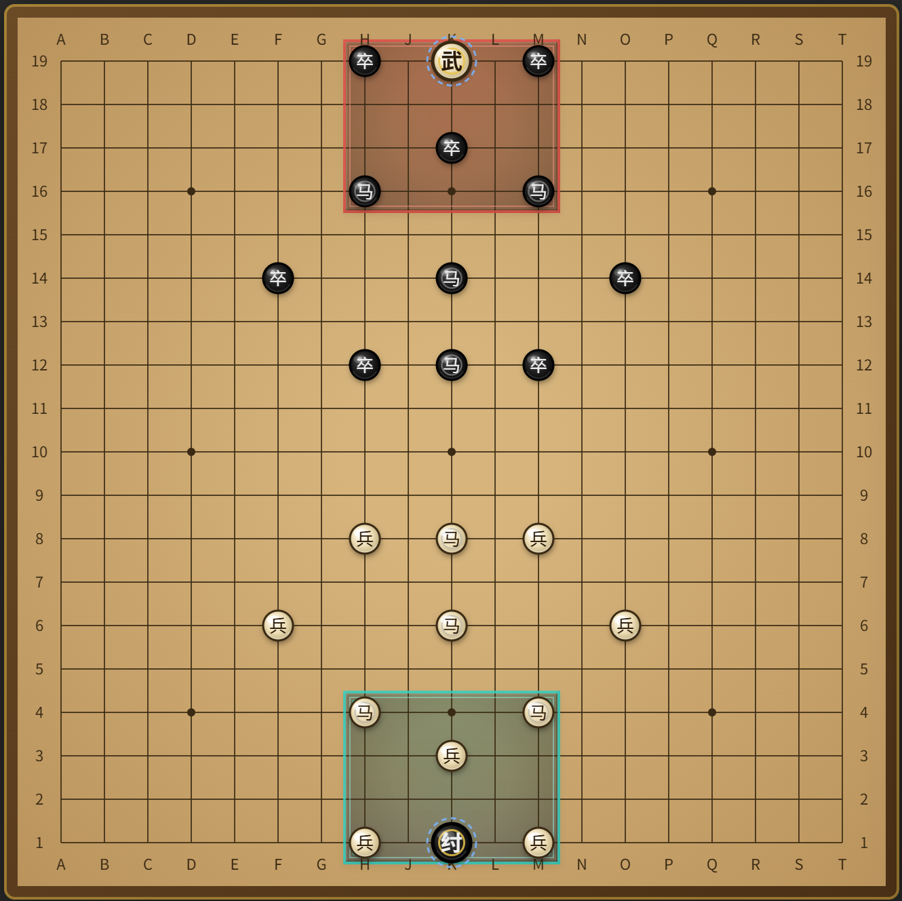

# 《商周大战》棋类游戏 V2

> 商纣围困武王于绝境，周军将士下山接应武王回京，击杀纣王。

一款基于中国古代商周历史改编的原创策略棋类游戏，支持本地双人对弈、AI 对战与局域网联机对战。



---

## 📖 游戏背景

商朝末年，纣王暴虐，天下诸侯反叛。周武王率军伐商，却在决战中身陷重围，被困于敌方王城之内，处于无敌禁锢状态。

玩家分为**白方**与**黑方**，互为攻守：
- **突围方**：指挥周军将士（小棋子）突破封锁，接应武王脱困，并化身分身奔袭敌方王城
- **围剿方**：调遣商军围追堵截，击杀对方逃跑的王

双方开局布局完全对称，既是攻方也是守方，胜负全在一念之间。

---

## 🎮 核心玩法

### 棋盘与阵营

- **棋盘**：19×19 标准围棋棋盘
- **王城**：双方各有一个王城（5×4 方形区域），位于棋盘顶端与底端中间
  - 白方王城：H-M 列，1-4 行
  - 黑方王城：H-M 列，16-19 行
- **棋子类型**：
  - **武王**（大棋子）：每方 1 个本体，开局被困于对方王城内
  - **小棋子**：士兵与马，可接应武王、可化身分身
  - **武王分身**：由小棋子转化而来，与本体无区别

### 移动规则

所有棋子每回合移动一枚：

| 移动类型 | 范围 | 适用棋子 | 说明 |
|---------|------|---------|------|
| 直线 | 横/竖 1-2 格 | 兵、卒、王棋、分身 | 2 格时中间不能有敌方棋子阻挡 |
| 斜线 | 斜 1-2 格 | 兵、卒、王棋、分身 | 2 格为"田字步"，不要求中间格空闲 |
| 日字 | L 形日字格 | 马 | 可以沿日字格跳跃，但是有"绊马腿"限制 |

**特殊规则**：
- 可穿过己方棋子，不可穿过敌方棋子
- 移动到敌方棋子位置即吃子，吃子后停止移动
- **绊马腿**：马移动时，若蹩脚方向（主移动方向 1 格处）有棋子，则该方向不可走（不论己方还是敌方棋子都会绊马腿）

### 武王系统

#### 🔒 禁锢状态
- 武王开局被 3 名敌军包围，处于**无敌禁锢状态**
- 无法移动，敌方也无法吃掉
- 包围判定：处于 2 名及以上敌方棋子吃子范围内

#### 🔓 解锁条件（满足其一）
1. **被动解锁**：包围武王的敌军数量 < 2，包围圈自动破裂
2. **主动接应**：己方任意棋子移动至武王行动范围内（2 格距离）

解锁后：
- 武王可自由移动
- **首次移动后**：解锁分身能力，同时失去无敌状态（可被吃）

#### 👥 分身机制
- **触发**：小棋子进入武王行动范围，可选择转化为武王分身
- **上限**：场上最多同时存在 2 个武王（本体 + 分身）
- **补满**：分身被吃后可继续转化新分身
- **不消耗回合**：移动到达后选择变身，本回合行动结束

#### 🔥 暴走状态
- **触发**：武王踏入己方王城
- **效果**：直线/斜线可走**无限格**（直到被阻挡）
- **副作用**：
  - 己方所有武王失去分身能力
  - 对方武王解除无敌禁锢状态

### 胜负判定

| 胜利条件 | 说明 |
|---------|------|
| **击杀对方全部武王** | 若对方有分身，须击杀所有武王（本体+分身） |
| **己方王解锁** | 击杀对方王时，己方王必须处于解锁状态 |

| 失败条件 | 说明 |
|---------|------|
| **己方王被吃** | 武王失去无敌后被击杀 |
| **灭子判负** | 己方王处于禁锢状态，且其余小棋子全部被吃 |
| **停棋判负** | 无合法移动可执行 |

**平局**：棋子循环走位 3 回合不变，判为平局。

---

## 🏗️ 设计架构

### 技术栈

- **纯前端**：HTML + CSS + 原生 JavaScript
- **零依赖**：无第三方库、无构建步骤
- **单文件交付**：`codes/商周大战.html`（约 165KB）
- **运行方式**：双击文件，浏览器打开即玩

### 架构分层

```
商周大战.html
├── <style>            视觉样式（CSS 变量主题系统）
├── <body>             布局：棋盘 Canvas + 信息面板 + 规则折叠栏
└── <script>           游戏逻辑
    ├── 数据层         Board/Piece 状态与坐标
    ├── 规则层         移动/吃子/禁锢/分身/暴走/胜负/平局判定
    ├── 渲染层         Canvas 绘制 + 信息面板刷新
    ├── 交互层         点击事件 → 选中 → 高亮 → 落子
    └── AI 引擎        negamax 搜索 + alpha-beta 剪枝
```

**分层职责**：
- **数据层**：只存状态，不碰 DOM
- **规则层**：读写全局局面状态，处理所有游戏规则判定
- **渲染层**：根据数据层状态重绘棋盘与面板
- **交互层**：把鼠标点击翻译成动作，交给规则层校验
- **AI 引擎**：独立模拟器 `sim`，规则函数逐一翻版，不触碰全局状态

### 坐标系统

采用围棋坐标系：
- 列字母：`A B C D E F G H J K L M N O P Q R S T`（共 19 列，跳过 I）
- 行数字：`1..19`，行 1 在棋盘底部，行 19 在顶部
- 中心点：`K10`

### 数据结构

```javascript
// 棋子对象
{
  id: Number,           // 唯一标识
  side: "white"|"black", // 阵营
  type: "king"|"soldier"|"clone", // 类型
  col: Number,          // 列坐标 (0-18)
  row: Number,          // 行坐标 (0-18)
  state: "imprisoned_invincible" | "free" | "berserk",
  isClone: Boolean      // 是否为分身
}
```

### 开局档位

游戏提供 3 个固定开局档位：

| 档位 | 棋子数 | 说明 |
|------|--------|------|
| 小战 | 16 子 | 快速对局，适合新手 |
| 大战 | 24 子 | 默认档位，平衡体验 |
| 决战 | 38 子 | 大规模战役，策略深度最高 |

另有**自定义摆子**模式，可自由布置棋子位置。

---

## 🤖 AI 对战系统

### 搜索算法

采用经典博弈树搜索框架：

- **核心算法**：Negamax + Alpha-Beta 剪枝
- **迭代加深**：深度 1→maxDepth 逐层推进
- **静态搜索**：叶节点接入只含吃子着法的搜索，消除水平线效应

### 优化技术

| 技术 | 说明 |
|------|------|
| 置换表 (TT) | Zobrist 哈希，跨迭代层保留，提升搜索深度 |
| MVV-LVA 排序 | 吃子着法优先，按被吃子价值降序 |
| History 启发 | 引发 β 截断的着法累加权重 |
| Killer 启发 | 记录引发截断的静默着法 |
| LMR | 延迟着法裁剪，减少搜索宽度 |
| RFP | 静态空着裁剪，提前截断 |
| Futility | 叶前裁剪，跳过无意义着法 |

### 评估函数

多维度综合评估：

| 维度 | 分值 | 说明 |
|------|------|------|
| 士兵 | 100 | 基准单位 |
| 分身 | 350 | 等同武王，须击杀才算灭王 |
| 武王本体 | 1500 | 王亡 = 决定性 |
| 禁锢惩罚 | -500 | 停摆 + 灭子判负风险 |
| 暴走加成 | +400 | 无限射线 + 解除对方王无敌 |
| 分身期权 | +120 | 转化机会 ≈ 多一个大子 |
| 机动性 | ×2 | 有可达格的棋子数差 |
| 围王潜力 | +max(0, 12-d)×5 | 己兵到对方王距离 |
| 解锁梯度 | +max(0, 12-d)×6 | 禁锢中己王到最近己兵距离 |

### 难度档位

难度范围 1~10，数值越大越强越慢，默认难度 5。

| 深度 | 说明 |
|------|------|
| 1-3 | 适合新手练习，思考时间极短 |
| 4-6 | 中等难度，单步通常 1~5 秒 |
| 7-10 | 高难度，单步可达数十秒，上限 1 分钟超时 |

---

## 🎨 界面特性

### 视觉设计

- **主题系统**：5 套配色方案（暖木/玄铁/素笺/星空/青山）
- **棋子样式**：白方白底黑字，黑方黑底白字
- **状态指示**：
  - 选中棋子描边
  - 可走格半透明绿色
  - 可吃格半透明红色
  - 王城区域淡色底块区分
  - 暴走状态光晕效果

### 功能面板

- **状态显示**：当前回合、武王状态、分身数量、步数
- **操作按钮**：新局、悔棋、复盘、研究模式
- **规则查询**：折叠式规则说明
- **棋谱记录**：完整对局记录，支持导入/导出

### 辅助功能

- **悔棋系统**：双人模式一次一手，AI 模式连撤两手
- **复盘模式**：回放完整对局，逐步分析
- **研究模式**：自由摆子，验证变化
- **自定义摆子**：自由布置初始局面，支持导入/导出布局

### 联机对战

- **局域网联机**：WebSocket 实时通信，零延迟
- **房间系统**：6 位房间码，一键创建/加入
- **布局同步**：房主选择的布局自动同步给对手
- **行棋倒计时**：每方 30 秒，超时 5 级 AI 自动代走
- **悔棋协商**：非阻塞按钮确认，双方同步退两步
- **断线重连**：自动重连，棋局状态缓存恢复
- **退出房间**：不断开连接，可重新创建/加入

### 对局结束动画

- **白方胜利**：金色光晕 + 彩色撒花粒子 + "🏆 胜 利 🏆"
- **黑方胜利**：紫色光晕 + 紫色花瓣粒子 + "🏆 胜 利 🏆"
- **失败**：红色光晕 + 棋盘震动 + "😿 下次一定… 😿"
- **平局**：蓝色光晕 + 蓝色粒子 + "🤝 平 局 🤝"

---

## 🚀 快速开始

### 运行游戏

1. 下载项目
2. 双击 `index.html` 或 `codes/商周大战.html`
3. 浏览器自动打开游戏界面

### 基本操作

1. **选择布局**：在右侧面板选择"小战/大战/决战/自定义"
2. **选择对手**：双人对弈 / AI 执黑 / AI 执白 / 联机对战
3. **选择难度**：1~10 档，默认 5（仅 AI 模式）
4. **开始游戏**：点击"新局"按钮（联机模式需创建/加入房间）
5. **行棋**：点击己方棋子 → 点击高亮的目标格
6. **分身选择**：移动到武王范围后，弹窗选择是否变身

### 联机对战操作

1. 选择"联机对战"，输入服务器地址，点击"连接"
2. 房主点击"创建房间"，获得 6 位房间号（双击可复制）
3. 对手输入房间号，点击"加入房间"
4. 每方 30 秒倒计时，超时 AI 代走
5. 悔棋需对方同意，点击"退出房间"可离开

### 快捷操作

- **悔棋**：点击"悔棋"按钮（AI 模式连撤两手，联机模式需对方同意）
- **复盘**：点击"复盘"按钮，逐步回放
- **切换主题**：在外观区域选择配色方案
- **查看规则**：展开规则折叠栏

---

## 📁 项目结构

```
商周大战/
├── index.html                 # 主入口（同步自 codes/商周大战.html）
├── server.js                  # 联机对战服务器（Node.js）
├── package.json               # 项目配置
├── start-server.bat           # Windows 一键启动脚本
├── codes/
│   ├── 商周大战.html          # 游戏主文件（单文件应用）
│   └── layouts/               # 自定义布局配置
├── docs/
│   ├── 《商周大战》棋类游戏规则说明书.txt  # 官方规则
│   ├── 设计文档.md            # 应用设计文档
│   ├── AI对战设计文档.md      # AI 系统设计文档
│   ├── 联机对战设计文档.md    # 联机对战技术设计
│   ├── 联机对战操作说明.md    # 联机对战使用指南
│   └── 封面截图-*.png         # 游戏截图
├── AGENTS.md                  # AI 助手工作指南
├── README.md                  # 本文件
└── .claude/                   # AI 助手配置与验证脚本
```

---

## 🧪 测试与验证

### 自动化测试

```bash
# AI 冒烟测试（自对弈验证）
node .claude/ai-smoke-test.js

# AI 棋力诊断（典型局面测试）
node .claude/ai-diag.js

# 规则验证脚本
node .claude/verify-setup-save.js
node .claude/verify-layout.js
node .claude/verify-horse.js
node .claude/verify-clone.js
```

### 手工验证清单

1. 双人模式完整对局（移动/吃子/分身/暴走/胜负/悔棋）
2. AI 执黑/执白模式
3. 三档难度表现
4. 悔棋/复盘/研究模式
5. 自定义摆子功能

---

## 📝 更新日志

### V2（当前版本）

- ✅ 局域网联机对战（WebSocket 实时通信）
- ✅ 房间系统：6 位房间码，一键创建/加入
- ✅ 布局同步：房主选择的布局自动同步给对手
- ✅ 行棋倒计时：每方 30 秒，超时 5 级 AI 代走
- ✅ 悔棋改进：非阻塞按钮确认，精确发给对手，退两步
- ✅ 断线重连：自动重连 + 棋局缓存恢复
- ✅ 联机 UI：进入房间后隐藏无关按钮，显示退出房间
- ✅ 对局结束动画：胜利撒花/失败震动/平局提示
- ✅ "档位"改名为"布局"
- ✅ 双击房间号复制
- ✅ 摆子界面增加"保存"按钮，校验后写入 localStorage
- ✅ 分身触发考虑绊马腿规则
- ✅ 增加马日字步蹩脚规则
- ✅ AI 吃子排序权重提升到百万级
- ✅ 布局同步：小战 16 子、大战 24 子、决战 38 子
- ✅ 摆子界面优化：还原布局、清空、导入、导出、保存、退出
- ✅ AI 难度改为 1~10 档，默认 5
- ✅ 规则说明更新：移动规则表格、绊马腿说明
- ✅ 界面优化：外观按钮、复盘提示语精简

### V1（存档分支：shangzhoudazhan-V1）

- v1.5：主题系统与界面优化
- v1.4：自定义摆子与布局导入导出
- v1.3：暴走状态与解锁机制
- v1.2：分身机制完善
- v1.1：AI 对战系统（三档难度）
- v1.0：基础游戏框架，双人对弈

---

## 🤝 参与贡献

本项目为个人学习项目，欢迎提出建议和改进意见。

### 开发规范

- 单文件架构，所有代码集中在 `codes/商周大战.html`
- 修改规则时必须同步更新 `sim*` 模拟器函数
- 遵循"简单优先"原则，不做过度设计
- 保持零依赖，纯原生实现

### 已知约束

- 规则代码双份（全局规则层 + AI 模拟器），修改需同步
- 搜索不感知三次重复平局，由全局 `settleMove` 判定
- 首版不做开局库、残局表等高级特性

---

## 📄 许可证

本项目为个人学习项目，仅供学习交流使用。

---

## 🙏 致谢

- 围棋坐标系统参考围棋传统记谱方式
- AI 搜索算法参考国际象棋引擎设计
- 界面设计受中国传统棋类游戏启发

---

**享受游戏，感受策略的魅力！** 🎲
